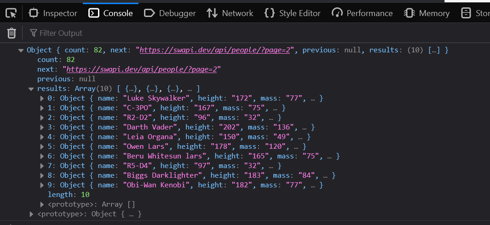
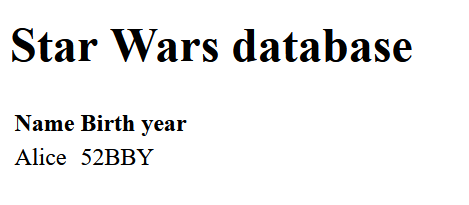
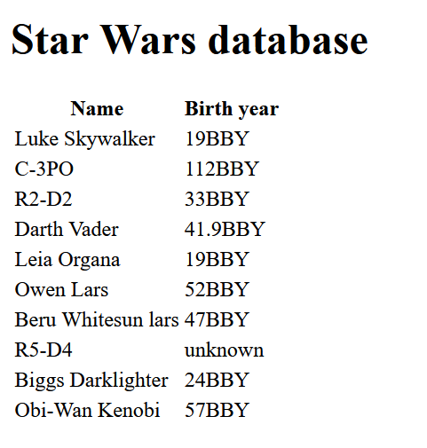
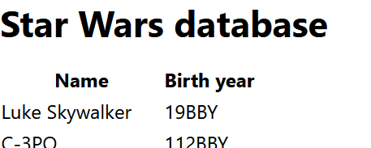
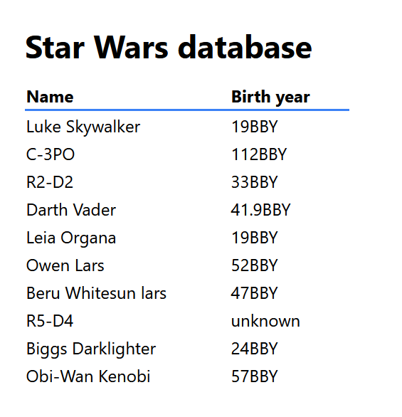
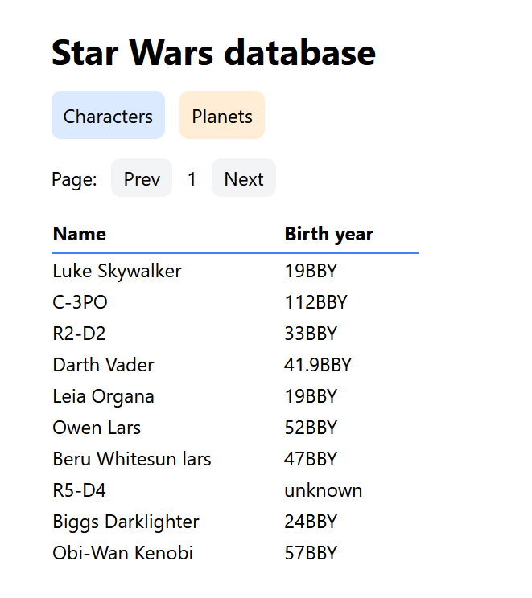

# Using the Star Wars API

There are many ways to get information about Star Wars, but the simplest is with the [Star Wars API (swapi.dev)](https://swapi.dev/). This API collects information about the films, characters, and planets throughout the series.

In this tutorial we'll show you how to pull data from this API and display it in a table:

- [Step 1: Basic HTML and Javascript](#step-1-basic-html-and-javascript)
- [Step 2: Grabbing the data](#step-2-grabbing-the-data)
- [Step 3. Waiting for the page to load](#step-3-waiting-for-the-page-to-load)
- [Step 4: Updating the table](#step-4-updating-the-table)
- [Step 5: Displaying our data](#step-5-displaying-our-data)
- [Step 6: Styling](#step-6-styling)


## Step 1: Basic HTML and Javascript

Let's start by creating some basic HTML. We've included a script tag to include our JS and a table for our data:

```html
<!DOCTYPE html>
<html>
  <head>
    <title>Star Wars database</title>
    <meta charset="UTF-8" />

    <!-- javascript -->
    <script></script>
  </head>
  <body>
    <h1>Star Wars database</h1>

    <!-- characters table -->
    <table>
      <thead>
        <tr>
          <th>Name</th>
          <th>Birth year</th>
        </tr>
      </thead>
      <tbody></tbody>
    </table>
  </body>
</html>
```


## Step 2: Grabbing the data

The Star Wars API makes many types of data available: films, people, planets, species, starships, and vehicles. You can see specifics on each of these endpoints on [the API documentation here](https://swapi.dev/documentation#wookiee).

For this tutorial, we'll display characters from the series. Looking at the API documentation, this is done with the [People endpoint](https://swapi.dev/documentation#people).

Let's start writing some Javascript:

```js
let url = "https://swapi.dev/api/people/?page=1";

// get the url
let response = await fetch(url);

// get the json data from the response
const data = await response.json();

console.log(data);
```

Using the [Fetch API](https://developer.mozilla.org/en-US/docs/Web/API/Fetch_API/Using_Fetch) makes it easy to call external APIs. If we include this in our `<script>` tag and reload the page, we can see the data appear in our console:




## Step 3. Waiting for the page to load

Trying to display data before the page has loaded can fail, so let's wait for the page to load before we make our API call.

First, let's put all of this inside a function:

```js
async function fetchCharacters() {
  let url = "https://swapi.dev/api/people/?page=1";

  let response = await fetch(url);
  const data = await response.json();

  console.log(data)
}
```

> 📘 Note: We need to make this an `async` function since we're using the [`await` operator](https://developer.mozilla.org/en-US/docs/Web/JavaScript/Reference/Operators/await).

Now that this is a function, we can use the [`DOMContentLoaded` event](https://developer.mozilla.org/en-US/docs/Web/API/Document/DOMContentLoaded_event) to call it! Let's add this script underneath the above:

```js
document.addEventListener("DOMContentLoaded", fetchCharacters);
```

This will call the `fetchCharacters` function once the page has loaded and is ready. You should see the same data appear in the console after reloading the page.

At this point, here's what our HTML and code looks like:

```html

<!DOCTYPE html>
<html>
  <head>
    <title>Star Wars database</title>
    <meta charset="UTF-8" />

    <!-- javascript -->
    <script>
      async function fetchCharacters() {
        // get data
        let url = "https://swapi.dev/api/people/?page=1";
        let response = await fetch(url);
        const data = await response.json();

        // display data
        console.log(data)
      }

      document.addEventListener("DOMContentLoaded", fetchCharacters);
    </script>
  </head>
  <body>
    <h1>Star Wars database</h1>

    <!-- characters table -->
    <table>
      <thead>
        <tr>
          <th>Name</th>
          <th>Birth year</th>
        </tr>
      </thead>
      <tbody></tbody>
    </table>
  </body>
</html>
```


## Step 4: Updating the table

Now we'll display the data which we grabbed! We want the data to appear in the table, and the script needs a way to insert data into the `tbody` tag. Let's make that simpler by giving this tag an ID:

```html
<tbody id="data"></tbody>
```

With this ID, we're able to insert data into this tag. Let's add this to our `fetchCharacters` function, just underneath our `console.log` call:

```js
document.getElementById("data").innerHTML = "<tr><td>Alice</td><td>52BBY</td></tr>"
```

This should add one row with the name "Alice" and the birth year "52BBY" to our table.

You should now see the new data appear:




## Step 5: Displaying our data

Now we can display things in the table. But to display the data we grabbed from the API, we need to add some more code.

Here's a simple snippet we can add to the end of our `fetchCharacters` function:

```js
data.results.forEach(character => {
  console.log(character);
});
```

This loops through each character from the result and prints it out. You can use this to see which attributes you want to display in your table.

Now instead of just printing the characters, let's create a row for each one:

```js
let rows = [];
data.results.forEach(character => {
  // create the new row
  let row = document.createElement("tr");

  // add the name and birth year columns
  let name = document.createElement("td");
  name.textContent = character.name;
  row.appendChild(name);

  let year = document.createElement("td");
  year.textContent = character.birth_year;
  row.appendChild(year);

  // add to our rows
  rows.push(row)
});
```

> 📘 Note: We're creating the elements this way, instead of making a string like we did for Alice, because this is safer if the API returns bad data. Take a look at the [`textContent` attribute](https://developer.mozilla.org/en-US/docs/Web/API/Node/textContent) for more details.

Now that we have a list of rows, let's add them to our table with the [`replaceChildren` method](https://developer.mozilla.org/en-US/docs/Web/API/Element/replaceChildren):

```js
document.getElementById("data").replaceChildren(...rows);
```

---

With the above changes, here's our final `fetchCharacters` function:

```js
async function fetchCharacters() {
  // get data
  let url = "https://swapi.dev/api/people/?page=1";
  let response = await fetch(url);
  const data = await response.json();

  // make rows
  let rows = [];
  data.results.forEach(character => {
    // create the new row
    let row = document.createElement("tr");

    // add the name and birth year columns
    let name = document.createElement("td");
    name.textContent = character.name;
    row.appendChild(name);

    let year = document.createElement("td");
    year.textContent = character.birth_year;
    row.appendChild(year);

    // add to our rows
    rows.push(row)
  });

  // display data
  document.getElementById("data").replaceChildren(...rows);
}
```

And here's what the page looks like:




## Step 6: Styling

Now that we've got our page loading and showing data, let's make it look nice!

Generally, you'd add a `style` tag or a new file for your CSS. But the [Tailwind CSS framework](https://tailwindcss.com/) takes a different approach.

Instead of writing your styles in another file or as a separate block, it defines a set of classes to do everything you need. And you use these classes on the elements you want to style. The benefit is that your styling lives alongside your markup, so you don't need to think as much.

---

Let's start making use of Tailwind for this project:

```diff
 <head>
   <title>Star Wars database</title>
   <meta charset="UTF-8" />
+  <script src="https://cdn.tailwindcss.com"></script>
```

Adding this tag lets us start using the Tailwind classes. Let's start off with the header:

```html
<h1 class="text-3xl font-bold mb-4">Star Wars database</h1>
```

This makes the header large, bold, and adds `16px` of padding underneath it. Tailwind also sets some defaults including a sans-serif font stack.

With the new header and font stack, here's what the page looks like:



Pretty! Let's add some padding to the body and improve that table:

```html
<body class="p-6"> <!-- 24px of padding -->
  <h1 class="text-3xl font-bold mb-4">Star Wars database</h1>

  <table>
    <thead>
      <tr class="border-b-2 border-blue-500"> <!-- 2px blue border on the bottom -->
        <th class="w-48 pb-1 text-left">Name</th> <!-- minimum width of 12rem, padding at bottom, and left-align the text -->
        <th class="w-28 pb-1 text-left">Birth year</th>
```

And here's how the final table looks:



There's much more you can do to improve the styling, but this is a good, simple start!


## Expanding on this

We're now finished, and you've got your page grabbing data from the Star Wars API and displaying it. But there are many ways to extend this sample page.

You can:

- Put the Javscript in a separate file.
- Add next and previous buttons, to change the page being displayed.
- Add buttons to grab the characters, planets, and optionally other data from the API.
- Show a 'loading' spinner while the data is fetched.

We've got an extended example including the above features, and some more styling:

- HTML: [`index.html`](./index.html)
- Javascript: [`main.js`](./main.js)

And I've got a live version of this extended sample [hosted here](https://danieloaks-docstest-starwars.netlify.app/).

This implements many of the above features, and you can click the Characters or Planets page to see it in action. Here's what the extended page looks like:



If you have any questions or comments, please reach out to <daniel@danieloaks.net>.
